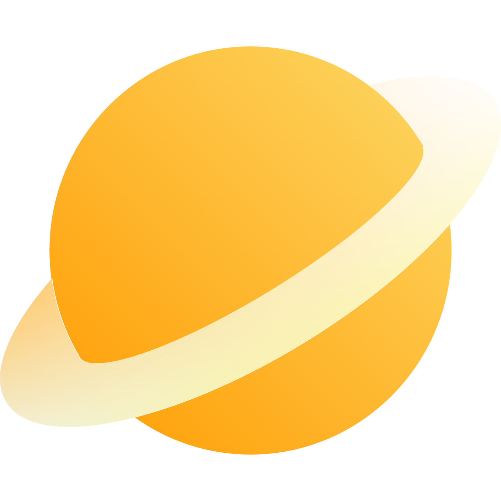

  

  <h1>Starte For PC</h1>

开发文档：https://discoverse.space/articles/starte-dev-docs/

观星记是一款使用 Electron 构建的天文壁纸软件。你可以在这里发现宇宙中数不胜数却鲜为人知的壮丽星球，并了解它们的故事；徜徉在无边无际的浩瀚星穹中，自由自在地浏览那些优美的文字；更可以在美丽星空的陪伴下，体验放空一切的专注。而这一切，都可以与他人尽情分享。从观星记开始，探寻星空之美。
